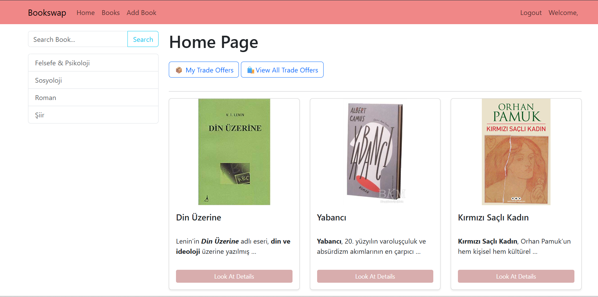
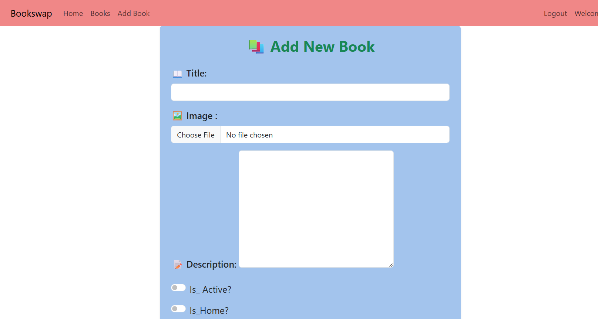
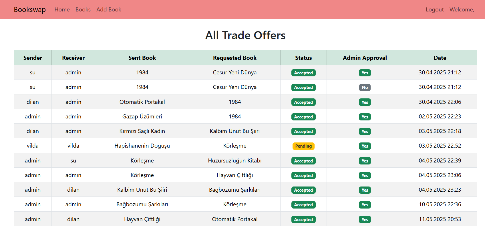
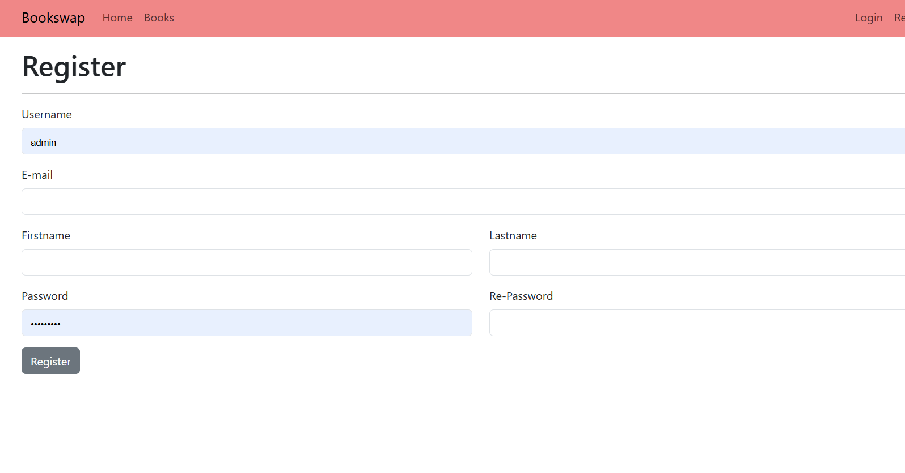
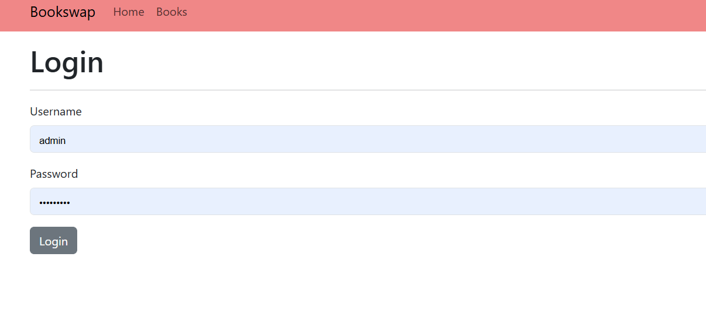
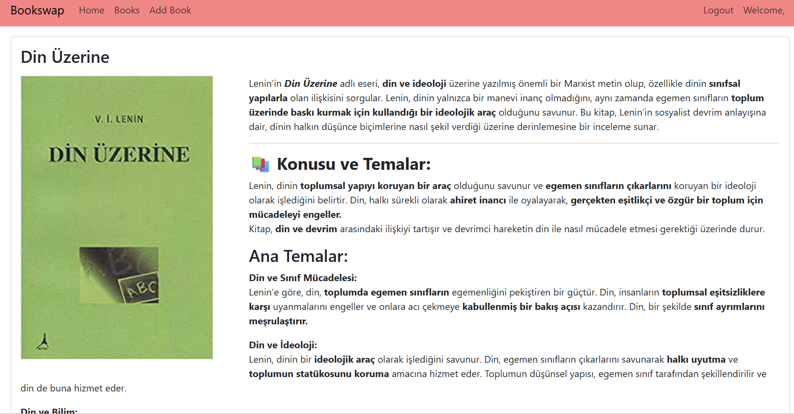
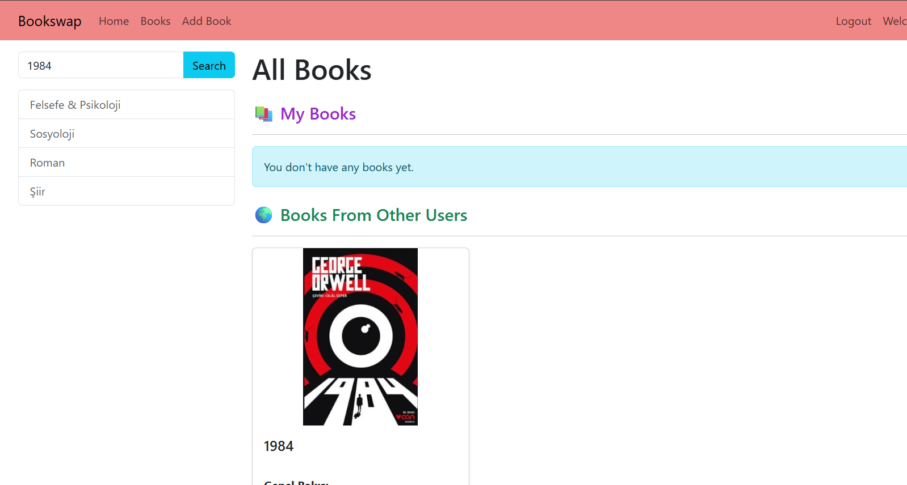

# BookSwap📚 Book Exchange Application

This project is a web-based platform that allows users to exchange books with each other. Users can list their own books, browse books added by others, and send trade offers. It's designed to promote the circulation of books through a simple and user-friendly interface.

---

## ✨ Features

### 👤 User Functionality
- User registration, login, and logout
- Each user can manage their own books
- Only authenticated users can send or receive trade offers

### 📘 Book Management
- Add books with a title, description, cover image, and categories
- Rich text support for book descriptions
- Books can be marked as active/inactive and optionally shown on the homepage

### 🧩 Category System
- Books can be tagged under one or more categories
- Filter books by category via the user interface

### 🔎 Search Capability
- Users can search books by title
- A search term filters books accordingly

### 🔁 Trade System
- Users can offer their own books in exchange for others’ books
- Received offers can be accepted or rejected
- Trade status is tracked and labeled as "Pending", "Accepted", or "Rejected"

### 🛡️ Admin Panel
- Admin can approve or deactivate books
- Books appear on the homepage only if approved and marked accordingly

---

## 📸 Screenshots

### 🏠 Homepage

### ➕ Add a New Book

### 🔁 Trade Offer Page

### 🏠 Register

### ➕ Login

### 🔁 My Trade Offer Page

### 🏠 Book Details

### ➕ Book Search

---

## 🧱 Project Structure
bookstore/
├── book/ # App containing book and trade logic
├── bookstore/ # Project configuration and settings
├── templates/ # HTML templates
│ └── book/
├── static/ # Static files (CSS, JS, icons)
├── media/ # Uploaded book cover images
└── db.sqlite3 # SQLite database (for development)

---

## 📌 Notes

- Built with Django (backend) and Bootstrap 5 (frontend)
- Designed for personal book exchange and hobbyist use
- Uses SQLite for simplicity in development

---
